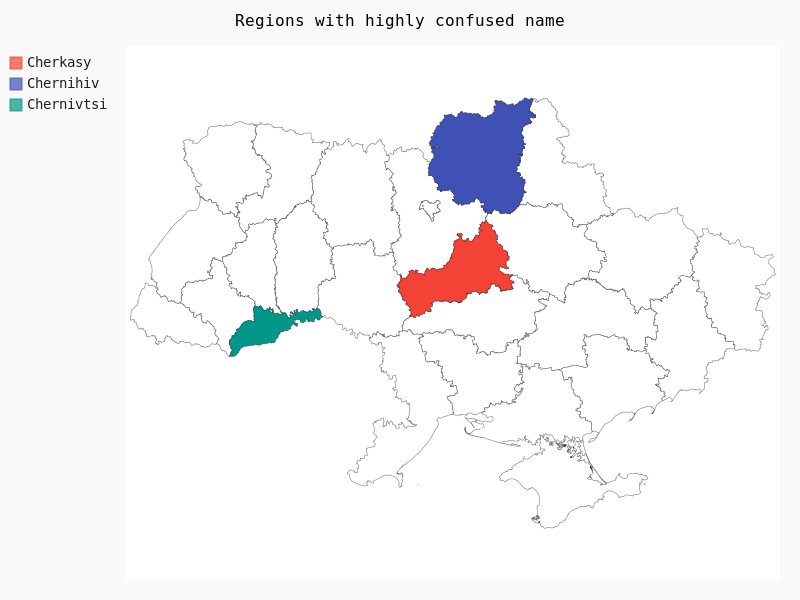

# pygal_maps_ua
### Ukraine maps for pygal

[🇺🇦 **Читати українською**](./README_ua.md)

This package provides map for administrative first level division of Ukraine

At the first level Ukraine is divided into **27** regions: **24** oblasts (regions), **1** autonomous republic (Crimea) and **2** cities with special status (Kyiv, Sevastopol)

## Install

```
pip install pygal_maps_ua
```

## Usage
```python
from pygal.maps.ua import Regions

map = Regions()
map.title = 'Regions with highly confused name'
map.add('Cherkasy', ['cherkasy'])
map.add('Сhernihiv', ['chernihiv'])
map.add('Сhernivtsi', ['chernivtsi'])

map.render_to_png('chart.png')
```

Result:



You can also specify a value for the region

```python
from pygal_maps_ua.maps import Regions, REGIONS_UA

map = Regions()
map.title = 'Number of letters in the region name'
map.add(
    "Letters count", 
    {x: len(y) for x, y in REGIONS_UA.items()}
)

map.render_to_png('chart.png')
```

Result:


## Temporarily occupied territories

It is possible to render a map with the **schematic visualization** of temporarily occupied territories of Donetsk and Luhansk regions (known as ORDLO). This area refers to territories [occupied by Russia in the 2014 year](https://en.wikipedia.org/wiki/Russian-occupied_territories_of_Ukraine#Before_February_2022)) and don't refer to territories, occupied by Russia during full-scale [Russian invasion of Ukraine in 2022](https://en.wikipedia.org/wiki/Russian_invasion_of_Ukraine)

You can use such a template by calling the ``RegionsOrdlo`` class and refer the occupied regions area and ``ordlo`` key respectively

```python
from pygal.maps.ua import RegionsOrdlo

map = RegionsOrdlo()
```

> **⚠ Warning**
> 
> It should be a **valid reason** to use such a map template instead of Regions template
> 
> The straight use-case is to visualize some statistical data from 2014 and clearly display that you have no data from the temporarily occupied territories
> 
> It is **strictly forbidden** to use this map template to dispute in any way the sovereignty and territorial integrity of Ukraine (including marking occupied territories as "disputed", "unrecognised", "self-proclaimed" or using any other formulations except "occupied" or "temporarily occupied" according to the UN resolutions [73/194](https://www.un.org/press/en/2018/ga12108.doc.htm), [ES-11/4](https://en.wikipedia.org/wiki/United_Nations_General_Assembly_Resolution_ES-11/4) and common sense).

The example of using the ``RegionsOrdlo`` for the use-case of visualizing the population of Ukraine on 1 Jan 2020 is provided below:

[(data source)](https://ukrstat.gov.ua/operativ/operativ2019/ds/kn/kn_u/kn1219_u.html)

```python
from pygal.maps.ua import RegionsOrdlo

population_2020_by_region = {
    "vinnytsia" :1545416,
    "volyn" :1031421,
    "dnipropetrovsk" :3176648,
    "donetsk" :4131808,
    "zhytomir" :1208212,
    "zakarpattia" :1253791,
    "zaporizhzhia" :1687401,
    "ivano-frankivsk" :1368097,
    "kyiv" :1781044,
    "kirovohrad" :933109,
    "luhansk" :2135913,
    "lviv" :2512084,
    "mykolaiv" :1119862,
    "odesa" :2377230,
    "poltava" :1386978,
    "rivne" :1152961,
    "sumy" :1068247,
    "ternopil" :1038695,
    "kharkiv" :2658461,
    "kherson" :1027913,
    "khmelnitskyi" :1254702,
    "cherkasy" :1192137,
    "chernivtsi" :901632,
    "chernihiv" :991294,
    "kyivcity" :2967360,
}


map = RegionsOrdlo(legend_at_bottom=True)

map.title = 'Population by region on 01 Jan 2020'
map.add('Population', population_2020_by_region)
map.add('Temporarily occupied territories', ['ordlo', 'crimea', 'sevastopolcity'])

map.render_to_png('chart.png')
```

Result:


## List of available regions

List of available regions is set as variables `REGIONS_UA` and `REGIONS_ENG` respectively and listed below:

| key            | description [ua]            | description [en]              |
|----------------|-----------------------------|-------------------------------|
| cherkasy       | Черкаська область           | Cherkasy Oblast               |
| chernihiv      | Чернігівська область        | Chernihiv Oblast              |
| chernivtsi     | Чернівецька область         | Chernivtsi Oblast             |
| crimea         | Автономна Республіка Крим   | Autonomous Republic of Crimea |
| dnipropetrovsk | Дніпропетровська область    | Dnipropetrovsk Oblast         |
| donetsk        | Донецька область            | Donetsk Oblast                |
| ivano-frankivsk | Івано-Франківська область   | Ivano-Frankivsk Oblast        |
| kharkiv        | Харківська область          | Kharkiv Oblast                |
| kherson        | Херсонська область          | Kherson Oblast                |
| khmelnitskyi   | Хмельницька область         | Khmelnytskyi Oblast           |
| kyiv           | Київська область            | Kyiv Oblast                   |
| kyivcity       | Київ                        | Kyiv                          |
| kirovohrad     | Кіровоградська область      | Kirovohrad Oblast             |
| lviv           | Львівська область           | Lviv Oblast                   |
| luhansk        | Луганська область           | Luhansk Oblast                |
| mykolaiv       | Миколаївська область        | Mykolaiv Oblast               |
| odesa          | Одеська область             | Odesa Oblast                  |
| poltava        | Полтавська область          | Poltava Oblast                |
| rivne          | Рівненська область          | Rivne Oblast                  |
| sevastopolcity | Севастополь                 | Sevastopol                    |
| sumy           | Сумська область             | Sumy Oblast                   |
| ternopil       | Тернопільська область       | Ternopil Oblast               |
| vinnytsia      | Вінницька область           | Vinnytsia Oblast              |
| volyn          | Волинська область           | Volyn Oblast                  |
| zakarpattia    | Закарпатська область        | Zakarpattia Oblast            |
| zaporizhzhia   | Запорізька область          | Zaporizhzhia Oblast           |
| zhytomir       | Житомирська область         | Zhytomyr Oblast               |

If you need to update the region names for your purposes (e.g. use only city names), use the `set_regions` or `set_regions_eng` functions

##### If you would like to support the author consider donating to the [United24](https://u24.gov.ua/) charity foundation

###### Data Source for Ukraine ADM1 borders:

Hijmans, Robert J.. University of California, Berkeley. Museum of Vertebrate Zoology. First-level Administrative Divisions, Ukraine, 2015. [Shapefile]. University of California, Berkeley. Museum of Vertebrate Zoology. Retrieved from https://maps.princeton.edu/catalog/stanford-gg870xt4706
