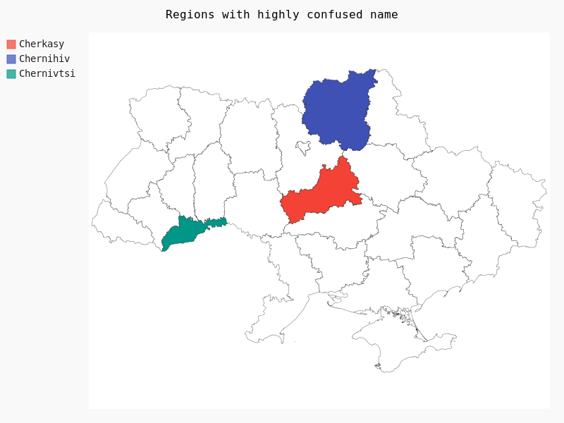
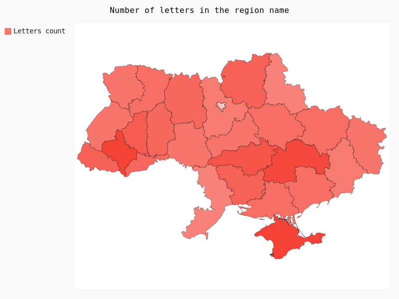
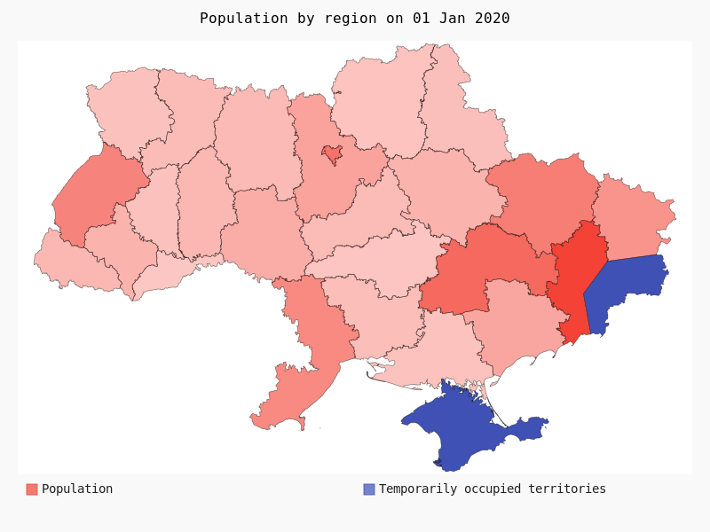

# pygal_maps_ua
### Мапа України для pygal

[🇬🇧 **Swith to english**](./README.md)

Плагін "Мапа України" для [Pygal](https://www.pygal.org/en/stable/) 

Дозволяє створити карту адміністративного поділу України першого рівня

На першому рівні Україна поділяється на **27** регіонів: **24** області, **1** автономна республіка (Крим) і **2** міста зі спеціальним статусом (Київ, Севастополь).

## Встановлення

```
pip install pygal_maps_ua
```

## Використання

Цей пакет є плагіном для бібліотеки візуалізації даних з відкритим кодом Pygal, тому перегляньте документацію [Pygal](https://www.pygal.org/en/stable/) та [Pygal / Типи діаграм / Мапи](https://www.pygal.org/en/stable/documentation/types/maps/index.html)  для глибшого розуміння коду нижче

(Приклад: Регіони зі схожими назвами)

```python
from pygal.maps.ua import Regions

map = Regions()
map.title = 'Regions with highly confused name'
map.add('Cherkasy', ['cherkasy'])
map.add('Сhernihiv', ['chernihiv'])
map.add('Сhernivtsi', ['chernivtsi'])

map.render_to_png('chart.png')
```

Результат:



Ви також можете вказати значення для регіону

(Кількість букв у назві області/регіону)

```python
from pygal_maps_ua.maps import Regions, REGIONS_UA

map = Regions()
map.title = 'Number of letters in the region name'
map.add(
    "Letters count", 
    {x: len(y) for x, y in REGIONS_UA.items()}
)

map.render_to_png('chart.png')
```

Результат:



## Тимчасово окуповані території

Є можливість створення карти зі **схематичною візуалізацією** тимчасово окупованих територій Донецької та Луганської областей (відомих як ОРДЛО). Ця схематизація відноситься до територій [окупованих росією у 2014му](https://en.wikipedia.org/wiki/Russian-occupied_territories_of_Ukraine#Before_February_2022) і не стосується територій, окупованих росією [під час повномасштабного вторгнення у 2022 році](https://en.wikipedia.org/wiki/Russian_invasion_of_Ukraine)

Створити таку візуалізацію можна викликавши клас ``RegionsOrdlo`` і звертаючись до окупованих територій за ключем ``ordlo`` відповідно

```python
from pygal.maps.ua import RegionsOrdlo

map = RegionsOrdlo()
```

> **⚠ Увага**
> 
> Має існувати насправді **поважна причина** для використання такого шаблону карти замість шаблону Regions
> 
> Передбачений варіант використання — візуалізувати деякі статистичні дані з 2014 року і чітко показати, що у вас немає даних з тимчасово окупованих територій
> 
> **Категорично заборонено** використовувати цей шаблон карти для будь-якого заперечення суверенітету та територіальної цілісності України (зокрема, позначати окуповані території як «спірні», «невизнані», «самопроголошені» або використовувати будь-які інші формулювання, крім «окуповані» або «тимчасово окуповані» відповідно до резолюцій ООН [73/194](https://www.un.org/press/en/2018/ga12108.doc.htm), [ES-11/4](https://en.wikipedia.org/wiki/United_Nations_General_Assembly_Resolution_ES-11/4) та здорового глузду).

Нижче наведено приклад використання ``RegionsOrdlo`` для візуалізації населення України на 1 січня 2020 року:

[(джерело даних)](https://ukrstat.gov.ua/operativ/operativ2019/ds/kn/kn_u/kn1219_u.html)

```python
from pygal.maps.ua import RegionsOrdlo

population_2020_by_region = {
    "vinnytsia" :1545416,
    "volyn" :1031421,
    "dnipropetrovsk" :3176648,
    "donetsk" :4131808,
    "zhytomir" :1208212,
    "zakarpattia" :1253791,
    "zaporizhzhia" :1687401,
    "ivano-frankivsk" :1368097,
    "kyiv" :1781044,
    "kirovohrad" :933109,
    "luhansk" :2135913,
    "lviv" :2512084,
    "mykolaiv" :1119862,
    "odesa" :2377230,
    "poltava" :1386978,
    "rivne" :1152961,
    "sumy" :1068247,
    "ternopil" :1038695,
    "kharkiv" :2658461,
    "kherson" :1027913,
    "khmelnitskyi" :1254702,
    "cherkasy" :1192137,
    "chernivtsi" :901632,
    "chernihiv" :991294,
    "kyivcity" :2967360,
}


map = RegionsOrdlo(legend_at_bottom=True)

map.title = 'Population by region on 01 Jan 2020'
map.add('Population', population_2020_by_region)
map.add('Temporarily occupied territories', ['ordlo', 'crimea', 'sevastopolcity'])

map.render_to_png('chart.png')
```

Результат:




## Перелік регіонів

Список доступних регіонів доступний у змінних `REGIONS_UA` та `REGIONS_ENG` відповідно та наведено нижче:

| key            | description [ua]            | description [en]              |
|----------------|-----------------------------|-------------------------------|
| cherkasy       | Черкаська область           | Cherkasy Oblast               |
| chernihiv      | Чернігівська область        | Chernihiv Oblast              |
| chernivtsi     | Чернівецька область         | Chernivtsi Oblast             |
| crimea         | Автономна Республіка Крим   | Autonomous Republic of Crimea |
| dnipropetrovsk | Дніпропетровська область    | Dnipropetrovsk Oblast         |
| donetsk        | Донецька область            | Donetsk Oblast                |
| ivano-frankivsk | Івано-Франківська область   | Ivano-Frankivsk Oblast        |
| kharkiv        | Харківська область          | Kharkiv Oblast                |
| kherson        | Херсонська область          | Kherson Oblast                |
| khmelnitskyi   | Хмельницька область         | Khmelnytskyi Oblast           |
| kyiv           | Київська область            | Kyiv Oblast                   |
| kyivcity       | Київ                        | Kyiv                          |
| kirovohrad     | Кіровоградська область      | Kirovohrad Oblast             |
| lviv           | Львівська область           | Lviv Oblast                   |
| luhansk        | Луганська область           | Luhansk Oblast                |
| mykolaiv       | Миколаївська область        | Mykolaiv Oblast               |
| odesa          | Одеська область             | Odesa Oblast                  |
| poltava        | Полтавська область          | Poltava Oblast                |
| rivne          | Рівненська область          | Rivne Oblast                  |
| sevastopolcity | Севастополь                 | Sevastopol                    |
| sumy           | Сумська область             | Sumy Oblast                   |
| ternopil       | Тернопільська область       | Ternopil Oblast               |
| vinnytsia      | Вінницька область           | Vinnytsia Oblast              |
| volyn          | Волинська область           | Volyn Oblast                  |
| zakarpattia    | Закарпатська область        | Zakarpattia Oblast            |
| zaporizhzhia   | Запорізька область          | Zaporizhzhia Oblast           |
| zhytomir       | Житомирська область         | Zhytomyr Oblast               |

Якщо вам потрібно оновити назви регіонів для ваших цілей (наприклад, використовувати лише назви міст), використовуйте функції `set_regions` або `set_regions_eng`

##### Якщо ви хочете підтримати автора, зробіть пожертву благодійному фонду [Повернись живим](https://savelife.in.ua/)

###### Data Source for Ukraine ADM1 borders:

Hijmans, Robert J.. University of California, Berkeley. Museum of Vertebrate Zoology. First-level Administrative Divisions, Ukraine, 2015. [Shapefile]. University of California, Berkeley. Museum of Vertebrate Zoology. Retrieved from https://maps.princeton.edu/catalog/stanford-gg870xt4706
